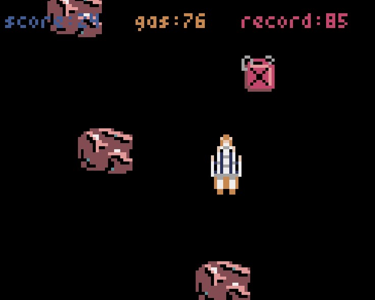

# Don't Crash The SpaceX Rocket!
## A Python-based pixel game

Instructions:

Make sure you have at least Python 3.13 installed, and install uv on your system
using "pip install uv" or however you see fit.

After cloning repo, run these commands from the working directory:

"python3 -m uv sync" (This will add the pyxel library to the venv)

"python3 -m uv run pyxel run app" to play!

